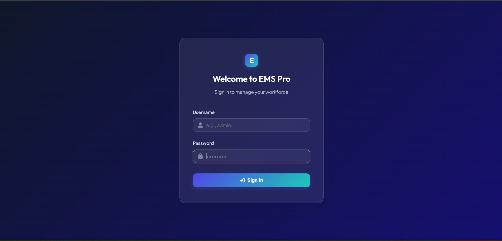
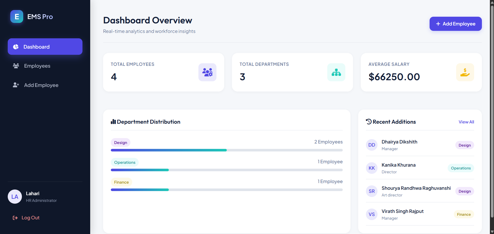
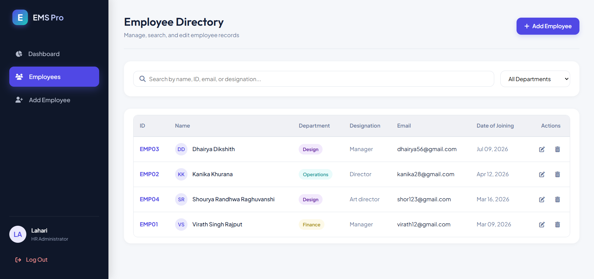
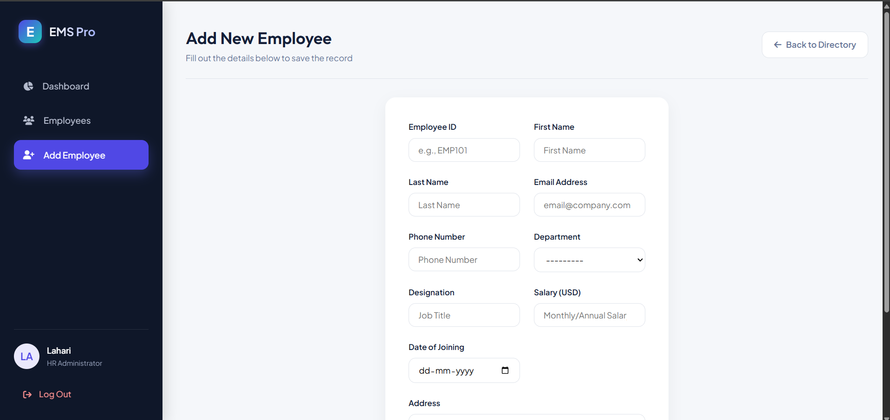
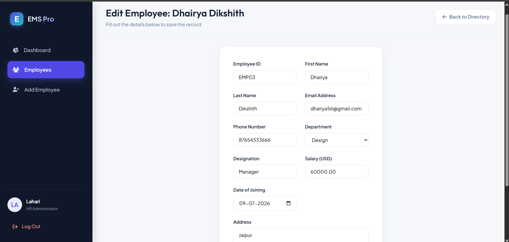
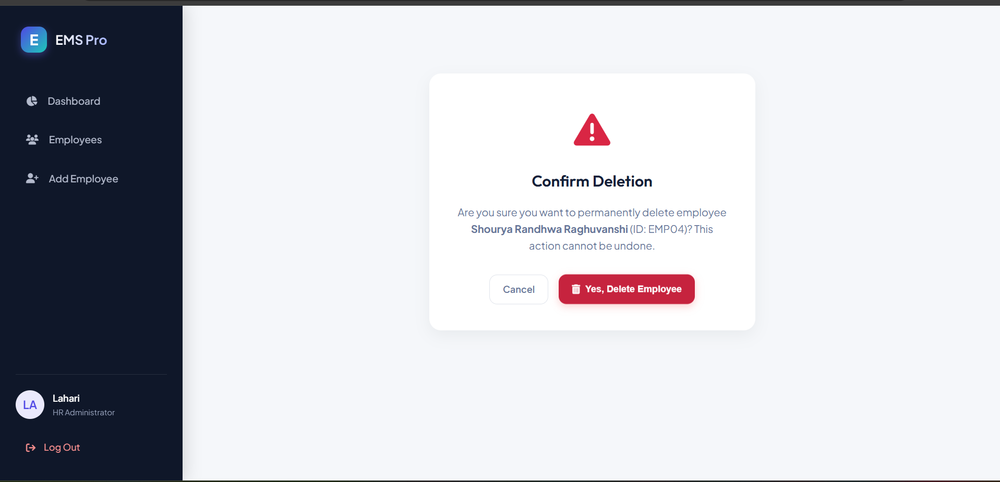

# 🏢 Employee Management System (EMS)

A modern and responsive **Employee Management System (EMS)** developed using **Django** to efficiently manage employee records. The application provides an intuitive interface for administrators to perform employee management operations, including creating, viewing, updating, and deleting employee information.

---

# 📖 Project Overview

The **Employee Management System** is a web-based application developed as part of the **NIELIT Full Stack Development Mini Project**. It demonstrates the implementation of Django's MVC architecture, database integration, template rendering, and CRUD operations while providing a user-friendly experience for managing employee data.

---

# ✨ Features

* 🔐 Secure Login Authentication
* 📊 Interactive Dashboard
* 👥 View Employee Records
* ➕ Add New Employees
* ✏️ Update Employee Details
* 🗑️ Delete Employee Records
* 🎨 Responsive and Clean User Interface
* 🗄️ SQLite Database Integration
* 📋 Easy Navigation and Management

---

# 🛠️ Tech Stack

| Technology | Description           |
| ---------- | --------------------- |
| Python     | Programming Language  |
| Django     | Backend Web Framework |
| HTML5      | Page Structure        |
| CSS3       | Styling               |
| SQLite3    | Database              |
| Git        | Version Control       |
| GitHub     | Repository Hosting    |

---

# 📂 Project Structure

```text
ems_portal/
│
├── employee_project/
│   ├── settings.py
│   ├── urls.py
│   ├── wsgi.py
│   └── asgi.py
│
├── employees/
│   ├── migrations/
│   ├── templates/
│   ├── admin.py
│   ├── forms.py
│   ├── models.py
│   ├── urls.py
│   └── views.py
│
├── static/
├── screenshots/
├── manage.py
├── db.sqlite3
├── requirements.txt
├── .gitignore
└── README.md
```

---

# 📸 Application Screenshots

## 🔐 Login Page



---

## 📊 Dashboard



---

## 👥 Employee List



---

## ➕ Add Employee



---

## ✏️ Update Employee



---

## 🗑️ Delete Confirmation



---

# 💡 Key Functionalities

* User Authentication
* Employee Record Management
* CRUD Operations
* Django Forms
* Template Rendering
* Static File Management
* Database Operations using SQLite
* Responsive User Interface

---

# 🚀 Future Enhancements

* 🔍 Employee Search & Filtering
* 👤 Employee Profile Pictures
* 📄 Pagination
* 📤 Export Employee Data (Excel/PDF)
* 📧 Email Notifications
* 👥 Role-Based Authentication
* 📊 Advanced Dashboard Analytics
* 🌐 REST API Integration

---

# 🎯 Learning Outcomes

This project helped in understanding and implementing:

* Django Project Structure
* Django Models
* URL Routing
* Views and Templates
* Forms and Validation
* CRUD Operations
* Database Management
* Git & GitHub Workflow
* Responsive Web Design

---

# 👩‍💻 Author

**Lakshmi Lahari**

**Mini Project:** Employee Management System (EMS)

**Course:** NIELIT Full Stack Development

**GitHub:** https://github.com/Lahari-2005

---

## ⭐ Thank You

Thank you for visiting this repository.